# **Ujian Akhir Semester : Deploy 2 System Apps Static Web dan Dynamic Web**
### 1. Membuat Insteance baru pada AWS Region ap-southeast-1 Singapore

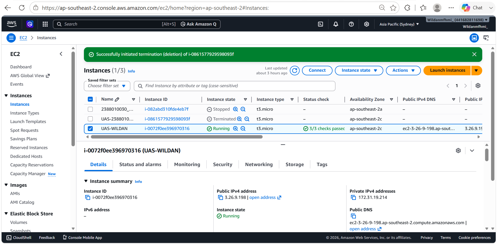

### 2. Membuat Folder Project UAS

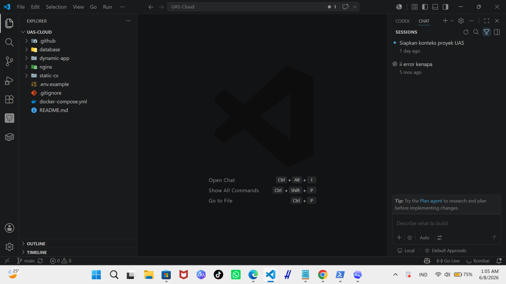

### 3. Masukkan web static UTS ke dalam folder Project UAS-CLOUD/static-cv

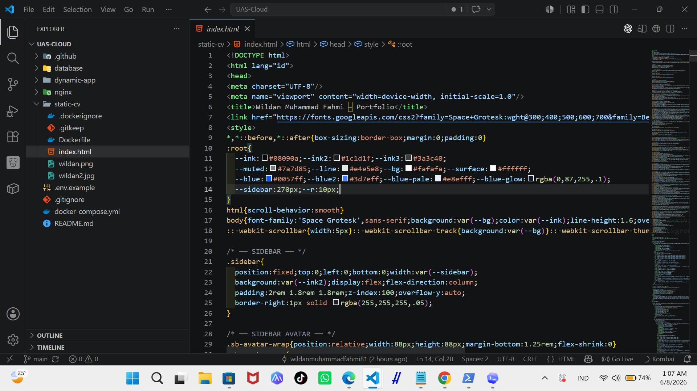

### 4. Membuat dynamic-app menggunakan PHP 

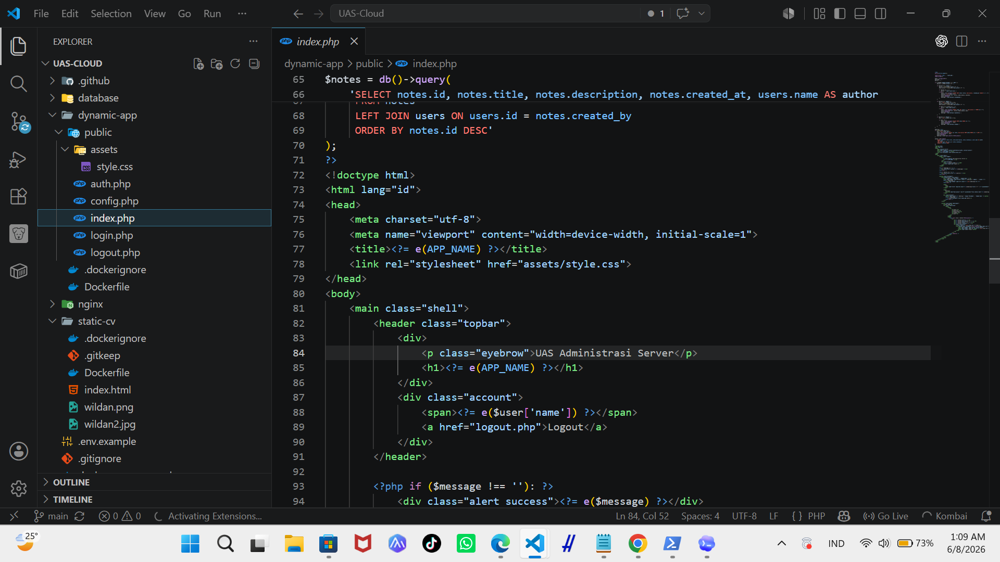

### 5. Install Docker dari repository resmi Docker (jalankan dipowershell)
    "sudo apt update"
    "sudo apt install -y ca-certificates curl gnupg"
    "sudo install -m 0755 -d /etc/apt/keyrings"
    "curl -fsSL https://download.docker.com/linux/ubuntu/gpg | sudo gpg --dearmor -o /etc/apt/keyrings/docker.gpg"
    "sudo chmod a+r /etc/apt/keyrings/docker.gpg"
    ". /etc/os-release"
    "echo "deb [arch=$(dpkg --print-architecture) signed-by=/etc/apt/keyrings/docker.gpg] https://download docker.com/linux/ubuntu ${VERSION_CODENAME} stable" | sudo tee /etc/apt/sources.list.d/docker.list > /dev/ null"
    "sudo apt update"
    "sudo apt install -y docker-ce docker-ce-cli containerd.io docker-buildx-plugin docker-compose-plugin"

    LALU AKTIFKAN DOCKER
    "sudo systemctl enable docker"
    "sudo systemctl start docker"
    "sudo usermod -aG docker ubuntu"

    LALU CEK APAKAH DOCKER BERHASIL DIINSTALL
    "docker --version"
    "docker compose version"

![!\[alt text\]](<install docker.png>)

### 6. Set Up Docker Hub
    BUAT REPOSITORY BARU PADA DOCKER HUB
    "gamine1/uas-static"
    "gamine1/uas-dinamic"

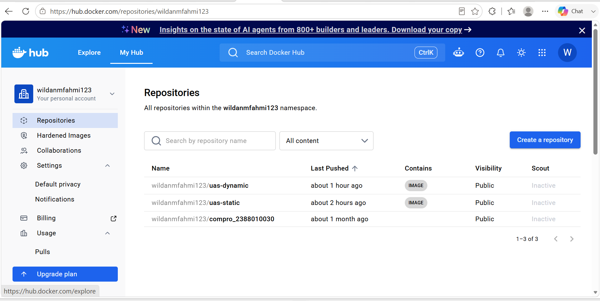

BUAT ACCESS TOKEN DOCKER HUB
    "Account Settings -> Personal access tokens -> Generate new token"
    "Permission : Read & Write"

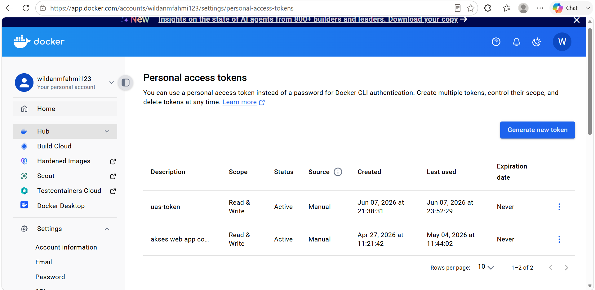

### 8. Login Docker ke EC2 Melalui PowerShell
    "docker login -u gamine1"
    (Saat diminta password, paste Docker Hub access token, bukan password akun biasa.)

    BUILD IMAGE DARI PROJECT
    Pastikan Posisi Folder di (cd ~/uas-cloud)
    lalu build "docker compose build static-cv dynamic-app"
    lalu push image ke docker hub "docker compose push static-cv dynamic-app"

![!\[alt text\]](<login docker ke ec2.png>)

### 9. Set Up Github Repository
    BUAT REPOSITORY BARU
    "https://github.com/bruc3luck-design/uas-cloud.git"

    LALU CONNECT FOLDER PROJECT KE REPOSITORY BARU
    "git remote add origin https://github.com/bruc3luck-design/uas-cloud.git"

    LALU PUSH FOLDER PROJECT KE REPOSITORY
    "git add ."
    "git commit -m "Initial UAS cloud deployment project""
    "git push -u origin main"

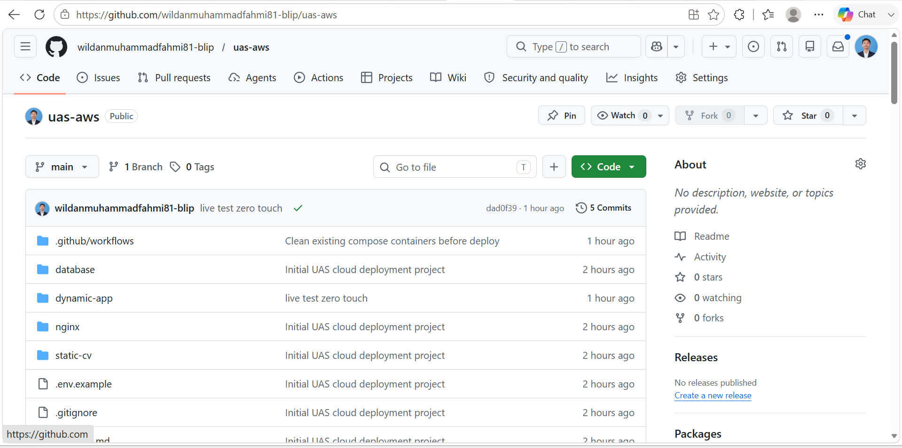

### 10. Set Up Github Secret
    DOCKERHUB_USERNAME = gamine1
    DOCKERHUB_TOKEN    = token Docker Hub kamu
    EC2_HOST           = IP public EC2 terbaru
    EC2_USER           = ubuntu
    EC2_SSH_KEY        = isi private key .pem
    STATIC_IMAGE       = gamine1/uas-static:latest
    DYNAMIC_IMAGE      = gamine1/uas-dinamic:latest
    MYSQL_DATABASE     = uas_db
    MYSQL_USER         = uas_user
    MYSQL_ROOT_PASSWORD = isi MYSQL_ROOT_PASSWORD dari .env
    MYSQL_PASSWORD      = isi MYSQL_PASSWORD dari .env

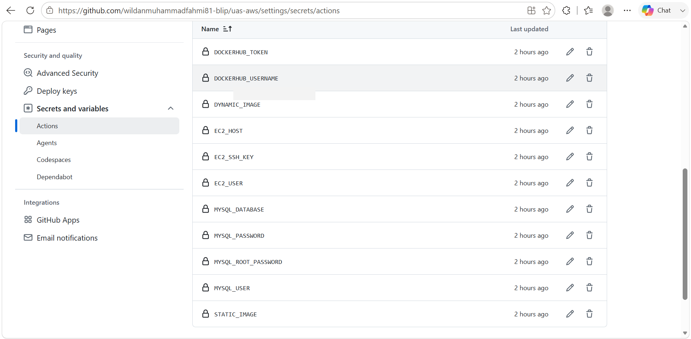

### 11. Set Up Github Action
    ".github/workflows/deploy-static.yml"
    ".github/workflows/deploy-dynamic.yml"

    CLONE REPOSITORY GITHUB KE EC2
    "rm -rf uas-cloud"
    "git clone https://github.com/bruc3luck-design/uas-cloud.git"
    "cd uas-cloud"
    "cp .env.example .env"

    COMMIT & PUSH WORKFLOW
    "git status"
    "git add .github/workflows/deploy-static.yml .github/workflows/deploy-dynamic.yml"
    "git commit -m "Add GitHub Actions deployment workflows""
    "git push origin main"

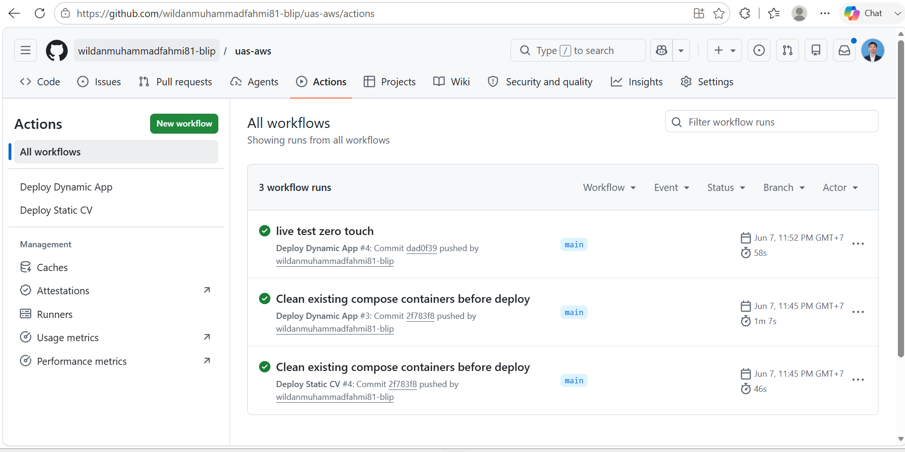

### 12. Tes Menjalankan Web Static & Dynamic
    Static

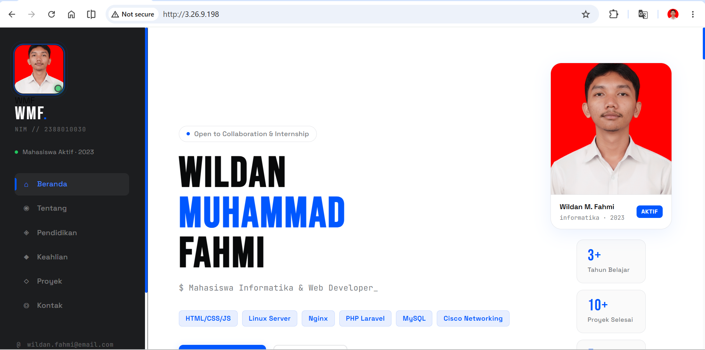

    Dynamic

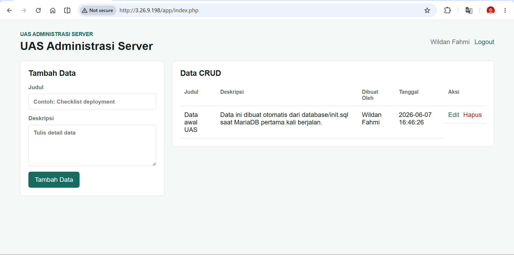