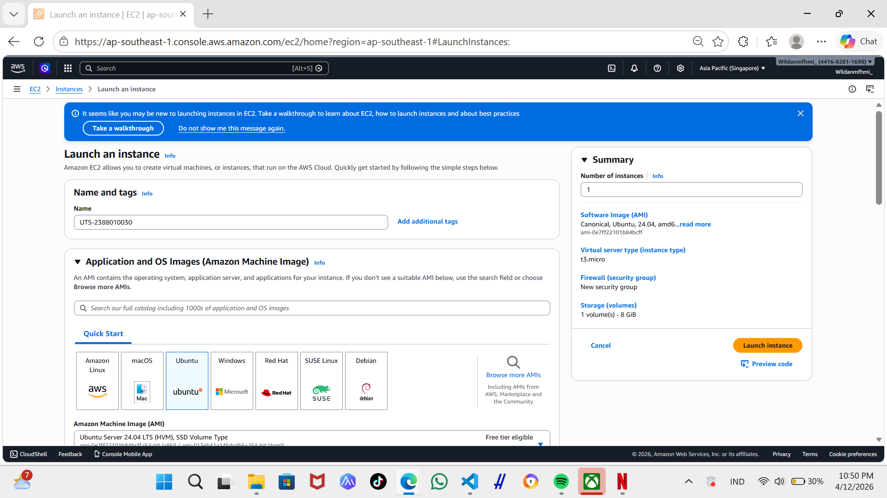
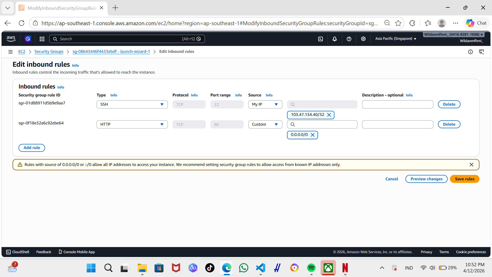
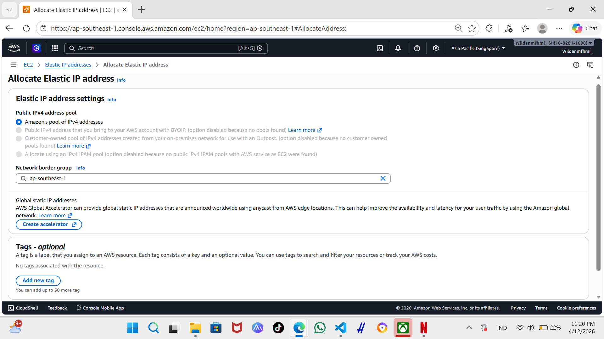
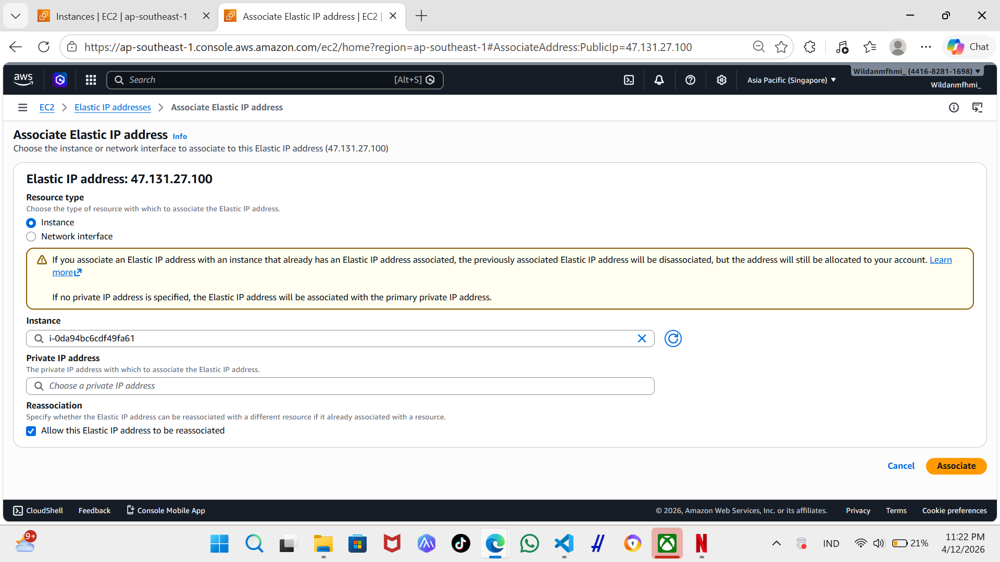
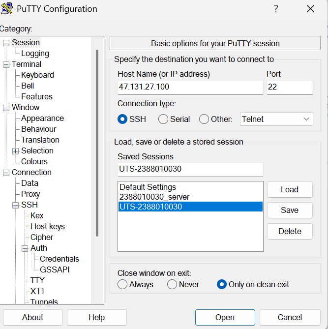
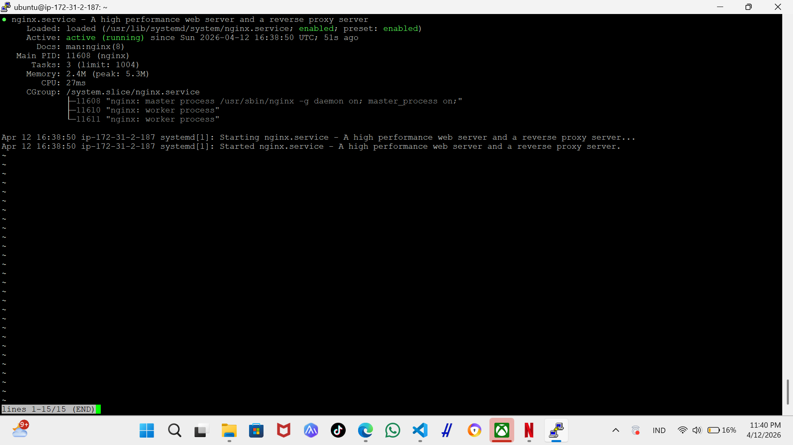
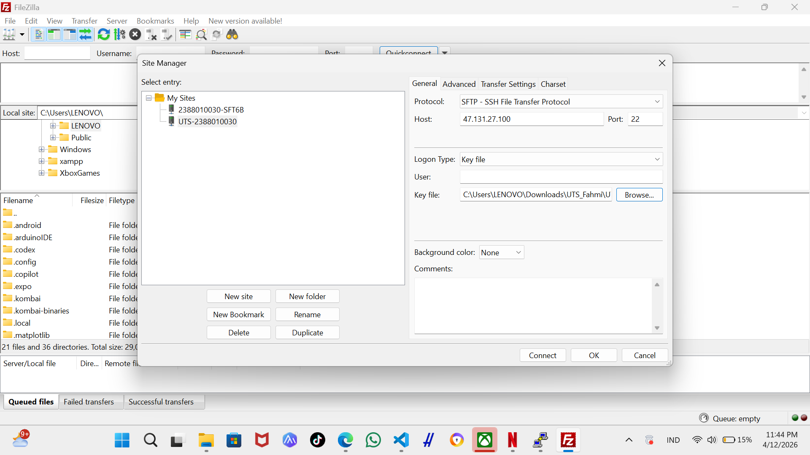
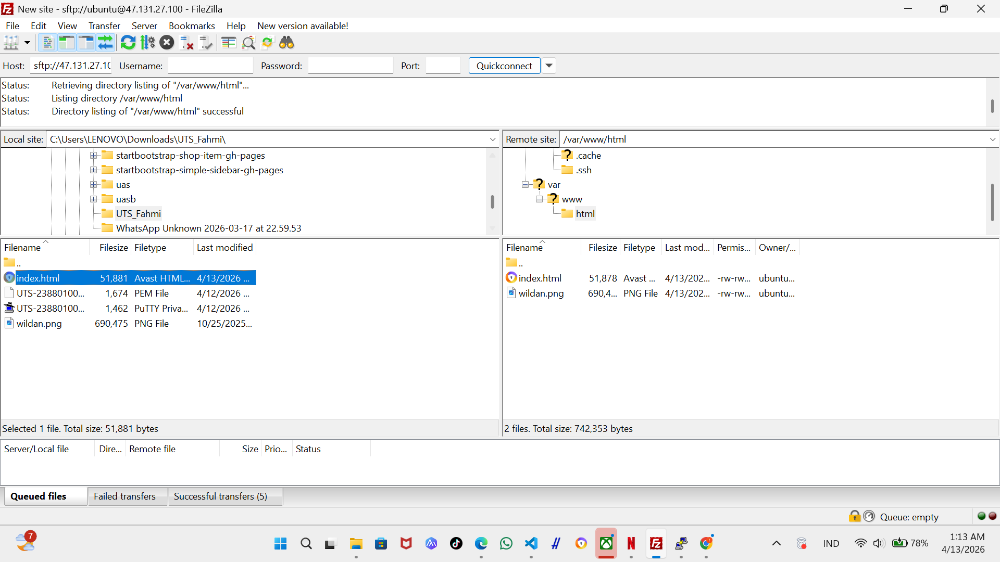

# UTS ADMINISTRASI SERVER

1. launch instance 

2. buat security gruop

3. create elastic ip

4. masuk ke putty gen

5. masuk ke putty 

sudo apt update
sudo apt upgrade -y
sudo apt install nginx -y
sudo systemctl start nginx
sudo systemctl enable nginx
sudo systemctl status nginx
(Tekan q)

6. masuk fileZilla

