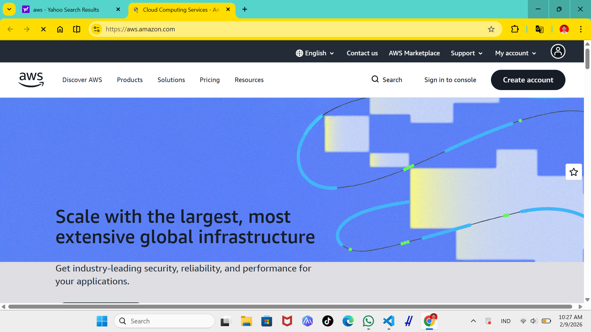
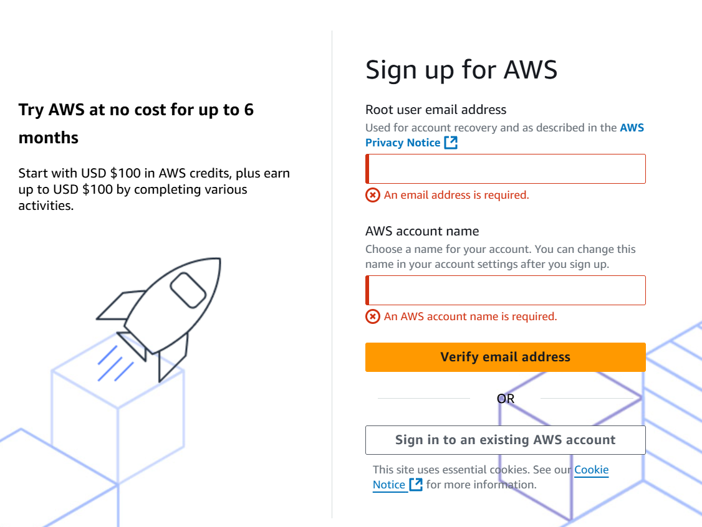
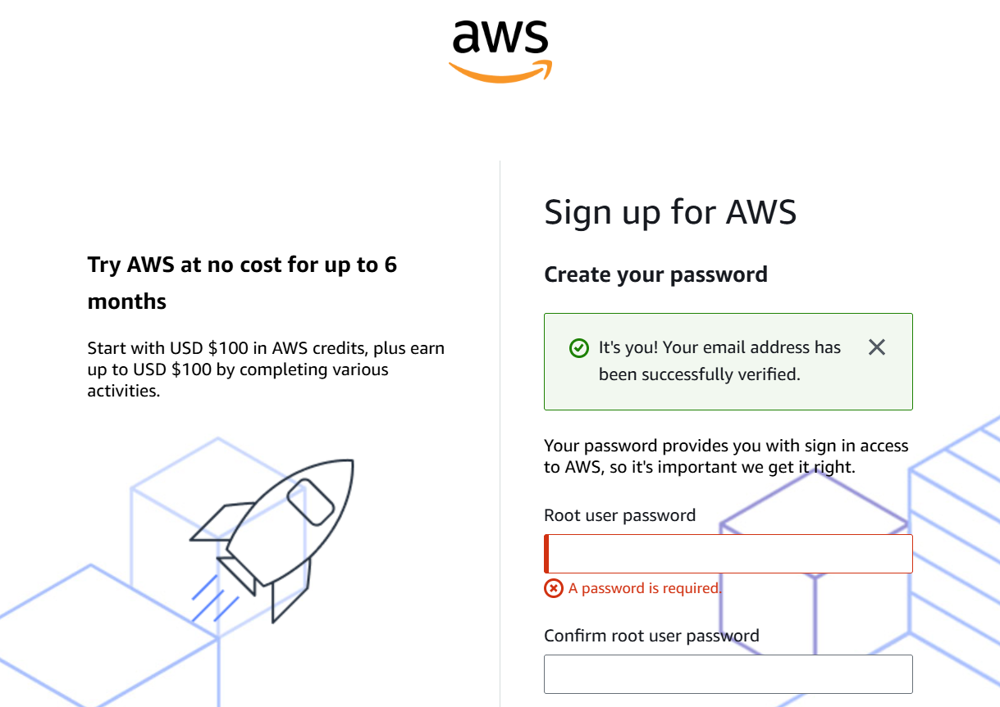
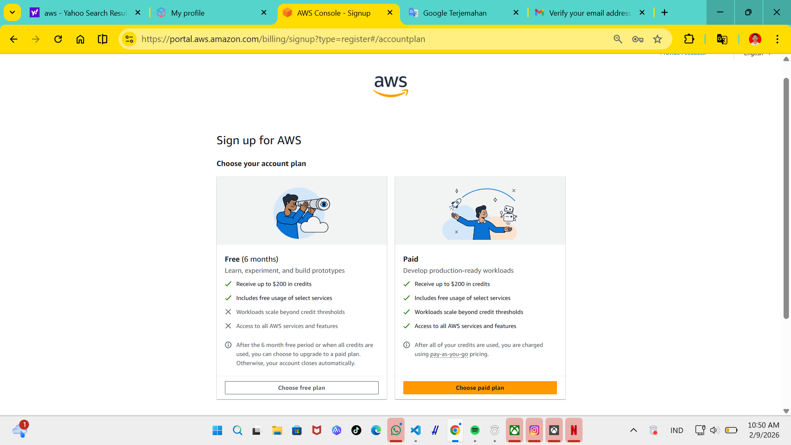
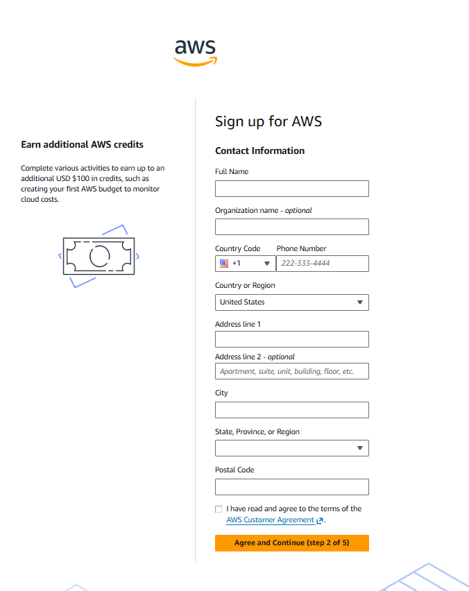

1. masuk ke halaman web [aws](https://aws.amazon.com/)

2. pilih menu creat account

3. memasukan password aws

4. after registerr di aws

5. sign up for aws

6. daftar no hp

7. verifikasi no hp

8. tampilan setelah berhasil login

