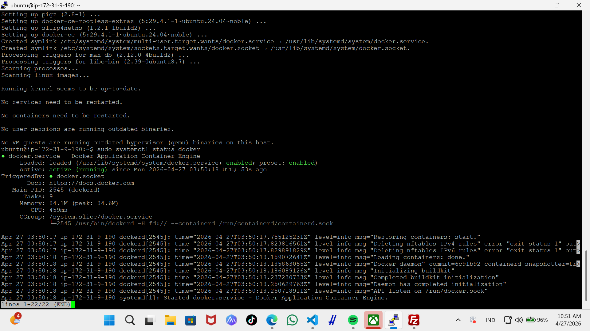
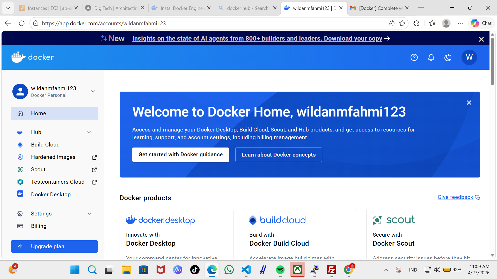
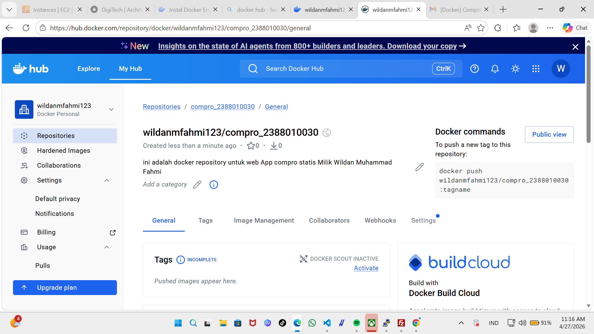

# Intro Docker Engine in instance EC2 AWS

1. install based docker documentation
    - https://docs.docker.com/engine/install/ubuntu/
    - uninstall old version docker
     sudo apt remove $(dpkg --get-selections docker.io docker-compose docker-compose-v2 docker-doc podman-docker containerd runc | cut -f1)
    - install docker 
    1) sudo apt update & sudo apt upgrade
    2) sudo apt install ca-certificates curl
       sudo install -m 0755 -d /etc/apt/keyrings
       sudo curl -fsSL https://download.docker.com/linux/ubuntu/gpg -o /etc/apt/keyrings/docker.asc
       sudo chmod a+r /etc/apt/keyrings/docker.asc
    3) add docker repository to APT
        sudo tee /etc/apt/sources.list.d/docker.sources <<EOF
        Types: deb
        URIs: https://download.docker.com/linux/ubuntu
        Suites: $(. /etc/os-release && echo "${UBUNTU_CODENAME:-$VERSION_CODENAME}")
        Components: stable
        Architectures: $(dpkg --print-architecture)
        Signed-By: /etc/apt/keyrings/docker.asc
        EOF
    4) update OS -> sodu apt-get update
    5) install docker engine ->  sudo apt install docker-ce docker-ce-cli containerd.io docker-buildx-plugin docker-compose-plugin
    6) cek installation -> sudo systemctl status docker

    

2. registrasi decker hub
    - login docker hub -> https://hub.docker.com/signup

    

3. create repository for docker
    - klik menu -> hub -> repository
    - klik button new repository
    - isi nama repositoy dengan nama = compro_nim(2388010030)
    - visibility nya public
    - klik create

    