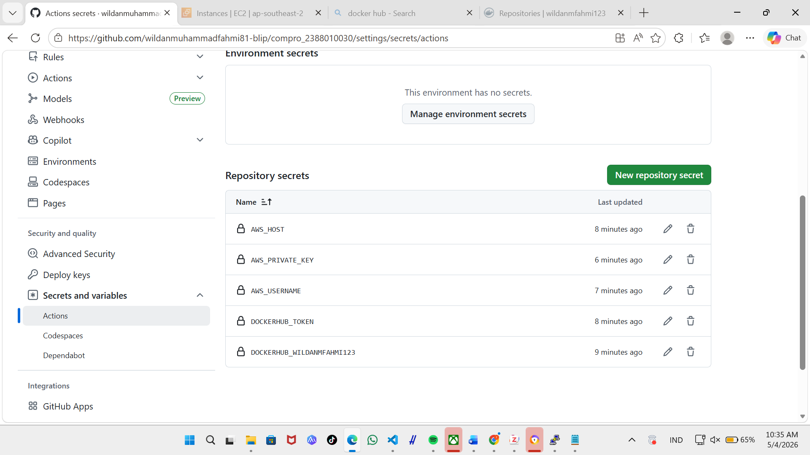

# modernisasi CI/CD (continuos integration/continous delivery)
## lanjutan dari praktikum pertemuan 10

1. mengisi secreets variabel di github actions 
    - buka repository github
    - klik setting -> secret and variables -> actions
    - klik new repository secret
    - isi nama = DOCKERHUB_USERNAME dan value
    - klik new repository secret
    - isi nama = DOCKERHUB_TOKEN  dan value = Token akun dockerhub
    - klik new repository secret
    - isi nama = AWS_HOST dan value = ip addres EC2 insance
    - klik new repository secret
    - isi nama = AWS_USERNAME dan value = ubuntu
    - klik new repository secret
    - isi nama = AWS_PRIVATE_KEY dan value = pilih file .pm (berisi tanda petik awal dan akhir juga)

2. melakukan edit file pipilne di github
    - buka project compro_nim
    - buat folder baru .github -> buat folder workflow -> buat file deploy.yaml
    - isi file deploy.yam sebagai berikut :

    nama : Deploy Next.js to AWS EC2
    on:
        push:
            branches: [ main ]

    jobs:
        build-and-deploy
            runs-on: ubuntu-latest
            steps:
            - name: checkout code
              uses: actions/checkout@v4

            - name: Login to Docker Hub
              uses: docker/Login-action@v3
              with:
                username: ${{ secrets.DOCKERHUB_USERNAME }}
                PASSWORD: ${{ SECRETS.DOCKERHUB_TOKEN}}

            - NAME: build and push Docker image
              uses: docker/build-push-action@v5
              with: 
                context:
                psuh: true
                tags: ${{ secrets.DOCKERHUB_USERNAME }}/compro_nim:latest

            - name: Deploy to EC2 via SSH and run docker compose
              uses: appleboy/ssh-action@v1.0.3
              with:
              host: ${{ serets.AWS_HOST }}
              username: ${{ secrets.AWS_USERNAME }}
              key: $

3. sebelum comit dan synch pada dile
    - pastikan sudah di sable apache2 -> sudo systemctl disable apache2
    - pastikan sudo stop apache2 -> sudo sytemctl stop apache2
    - pastikan user ubuntu udah ditambahkan ke docker 
    - baru lakukan commit dan push ke github