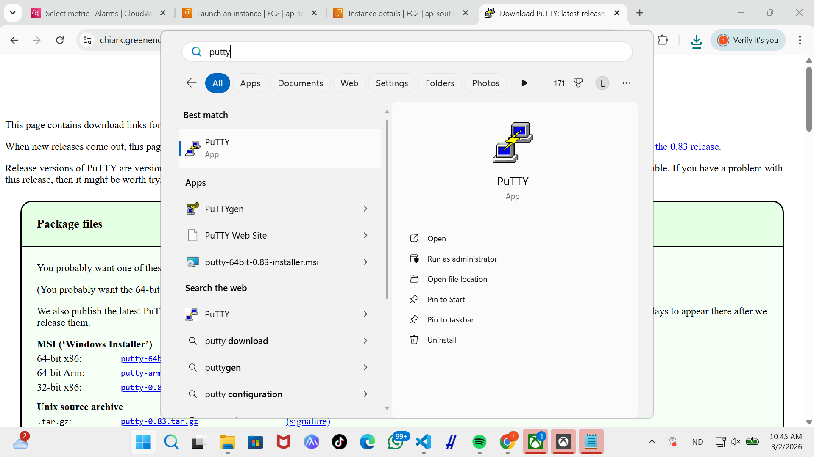
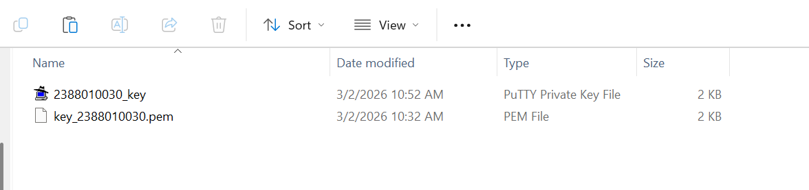
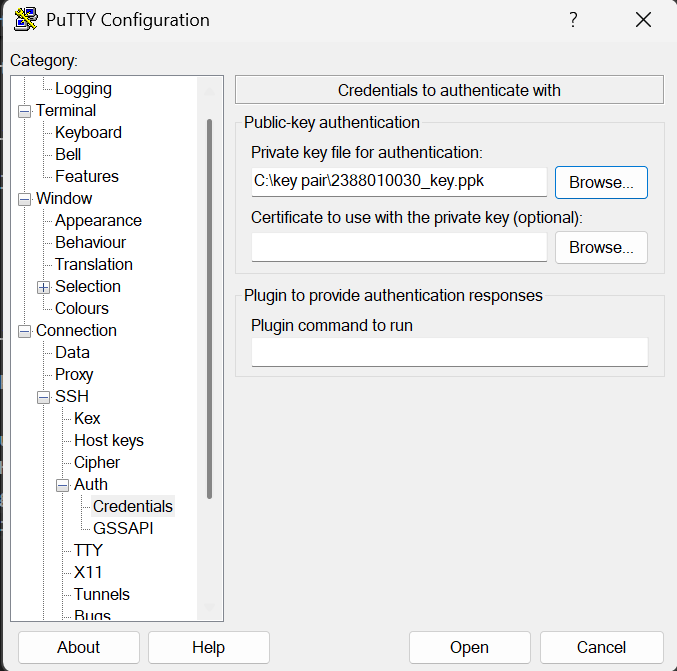
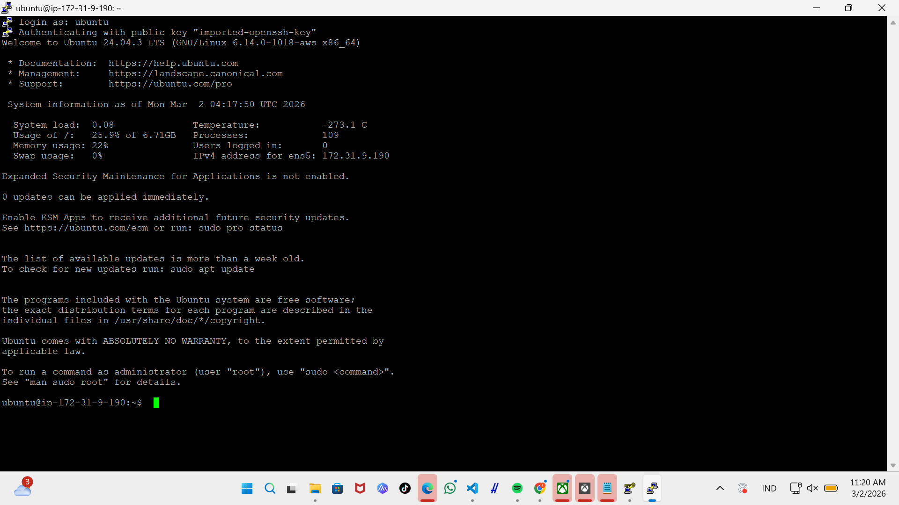
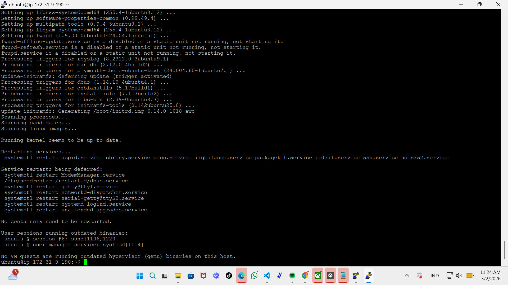
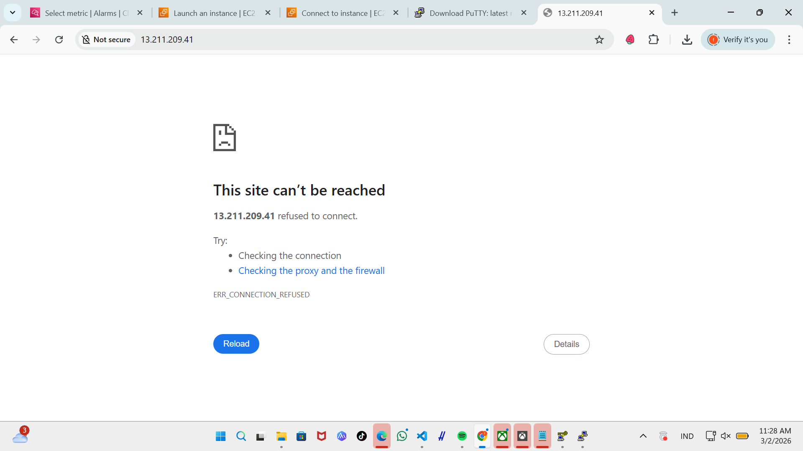
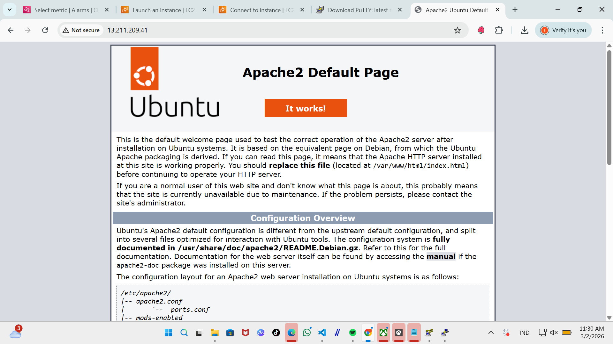
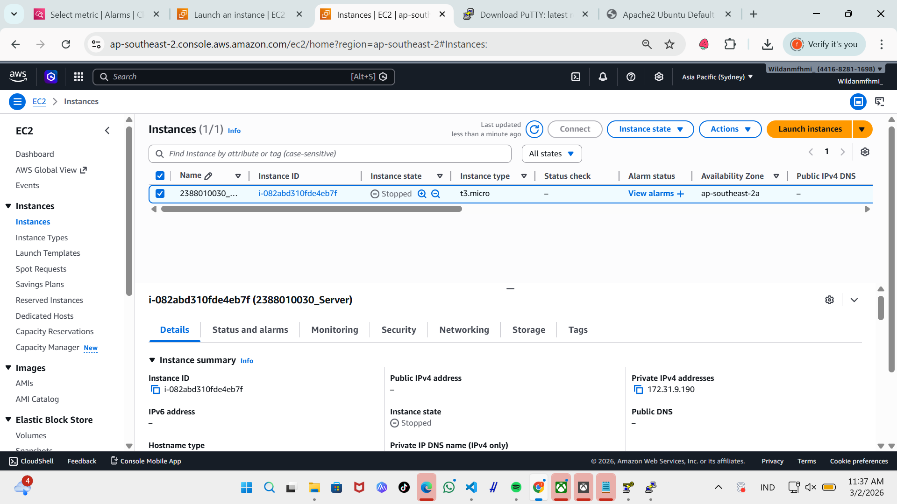

# Remote instance with ssh putty

1. pastikan udah install 

2. konfersi file public key dari .pem menajdi .ppk di putty
- buka puttyGen 
- load file .pem
- save as .ppk

3. set up putty untuk remote SSH
- buka apps putty
- isi IP public sesaui instance
- isi port untukk SSH sesuai security gruop di instance
- isi nama session agar saat di connect lagi tinggal load saja
- load file .ppk (klik SSH -> Auth -> creadentials -> load file .ppk) 
- kembali ke seseion -> kemudian save

4. sudo apt-get update (untuk update OS) lanjut sudo apt-get upgrade

5. pembuktian remote SSH secara visual
- copy IP public adres instance paste ke Browser

- Install Web server Seperti apache/Nginx
- sudo apt install apache2
- reload browser nya

6. matikan instance agar tidak kena tagihan
- masukan sudo shutdown now

