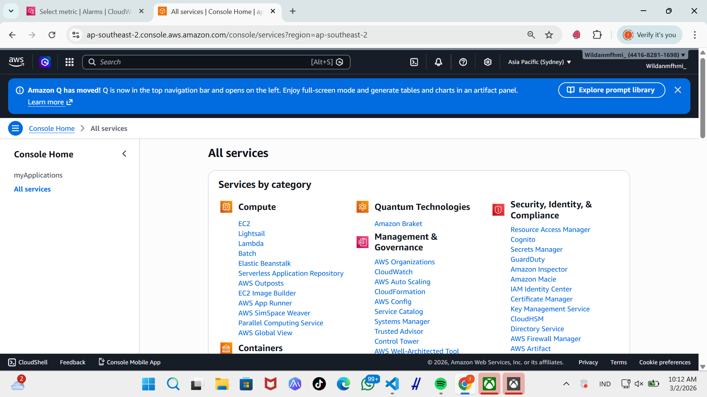
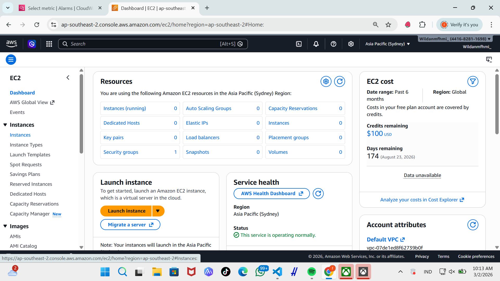
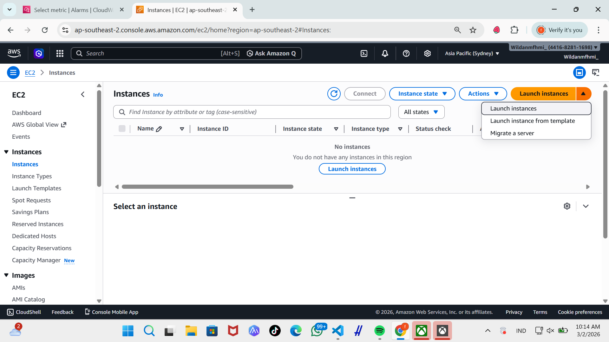
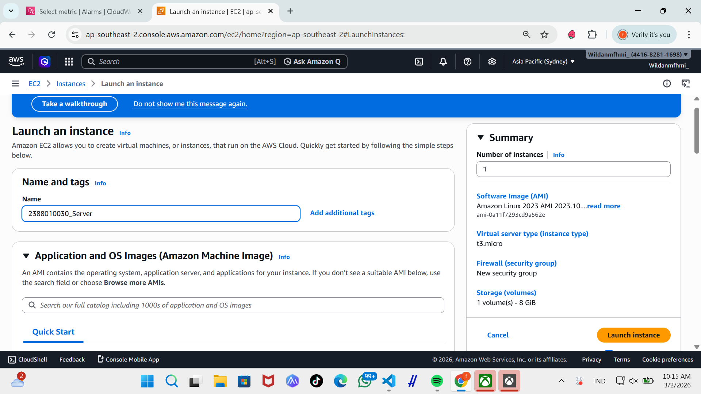
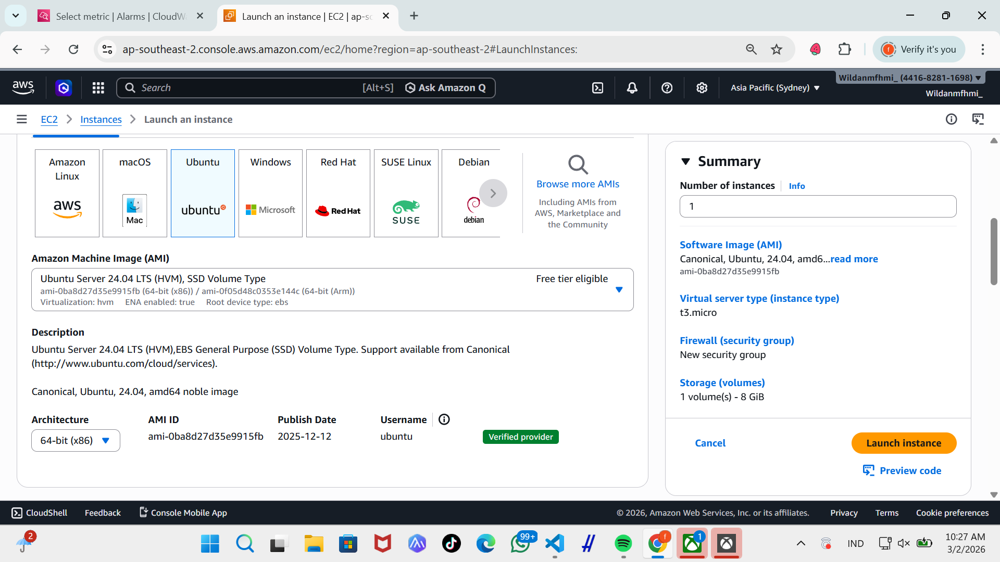
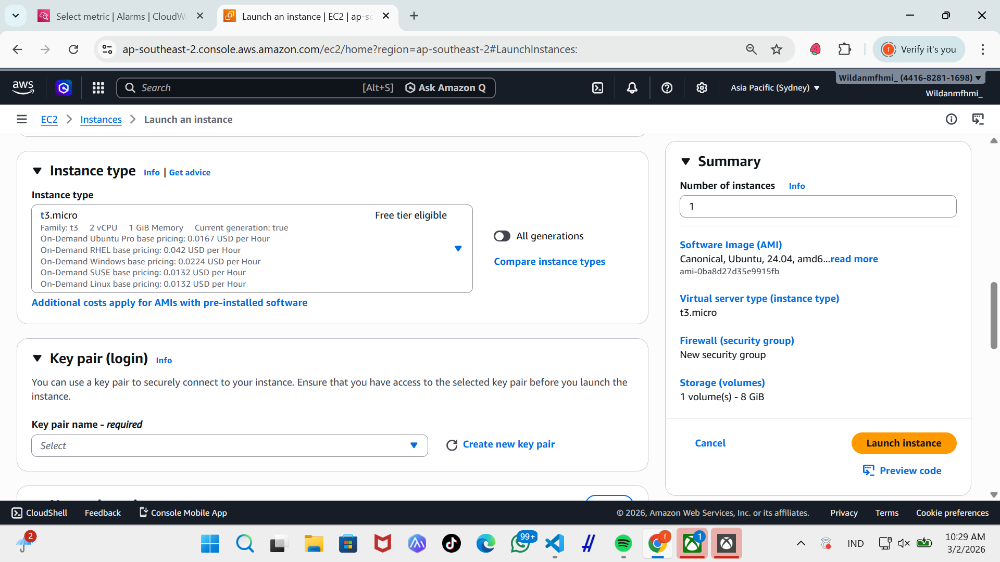
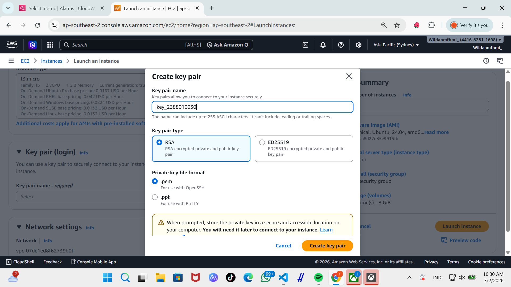
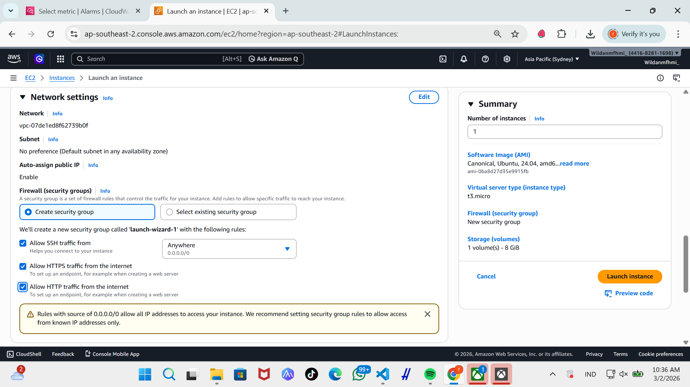
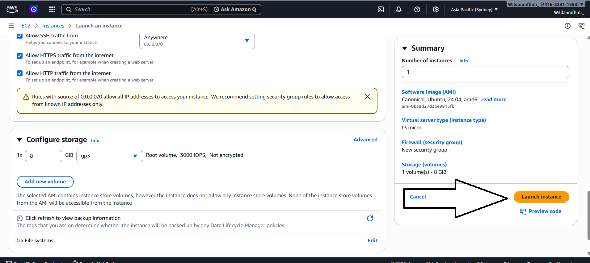
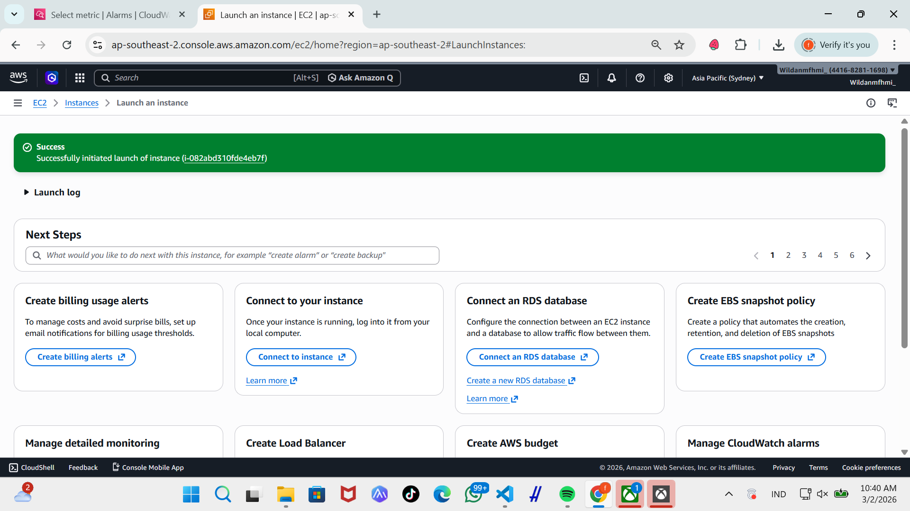

# membuat EC2 / instance / vm

1. pilih menu all services --> klik EC2

2. didalam menu EC2 pilih instance

3. didalam menu instance pilih launch instance 

4. beri nama instance dengan format NIM_server

5. pilih OS server untuk instance kita

6. pilih resource instance T3.Micro (2VCPU)

7. membuat key pair, pilih new key pair, isi nama key, 

8. setting kebijakan keamanan / security gruop  
    - allow SSH -> artinya membolehkan remote SSH dari luar
    - Allow HTTPS -> artinya instance bisa diakses dari protocol HTTPS
    - Allow HTTP -. artinya instance bisa diakses dari protocol HTTP

9. setealh selesai setup pilih launch instance

10. pastikan launch instance succes

