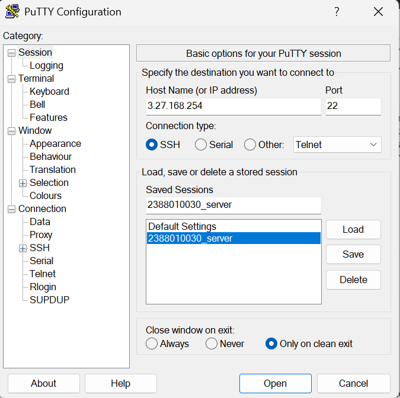
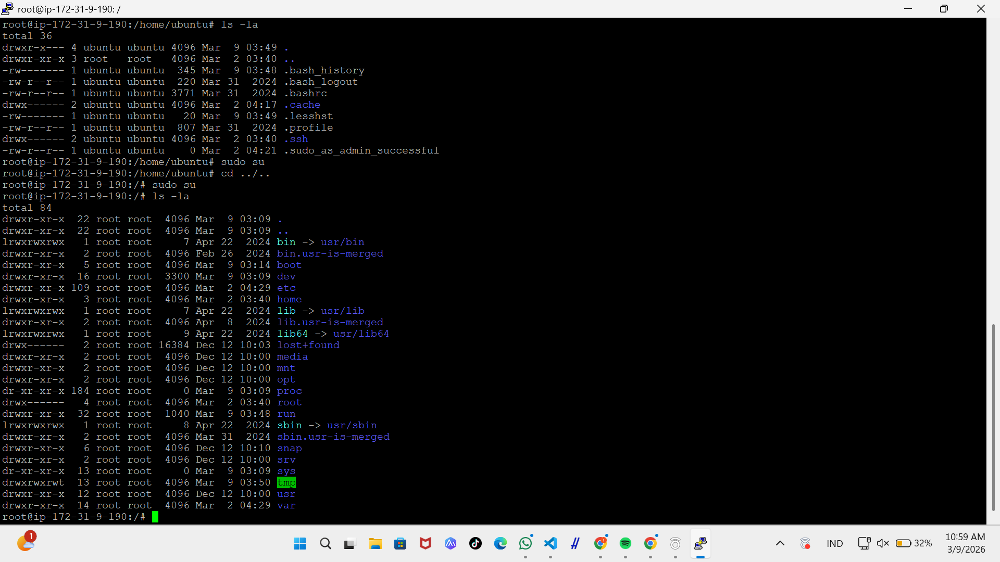
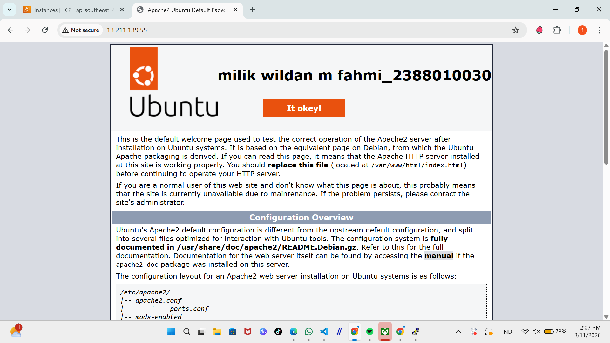

# implemntasi beberapa comand line interprance linux ubuntu

1. start instance
2. buka putty
3. kemudian load save session yg disimpan pada pertemuan 2 (NIM_SERVER)

4. update bagian IpAdress V4
5. sudo apt-get update(untuk paching OS Linux server)
6. cek web sserver kita(systemctl status apache2)
7. sudo systemctl stop apache2 (untuk memtikan)
8. sudo systemctl start apache2 (untuk memulai ulang Web Server)

9. masukan command (ls -la) untuk meilhat directory
10. masukan sodu su (untuk masuk ke home)
11. masukn cd ../.. untuk ke root folder ls -la

12. masuk ke folder var (cd var/www/html)
13. nano index.html untuk costum Nama dan Nim
