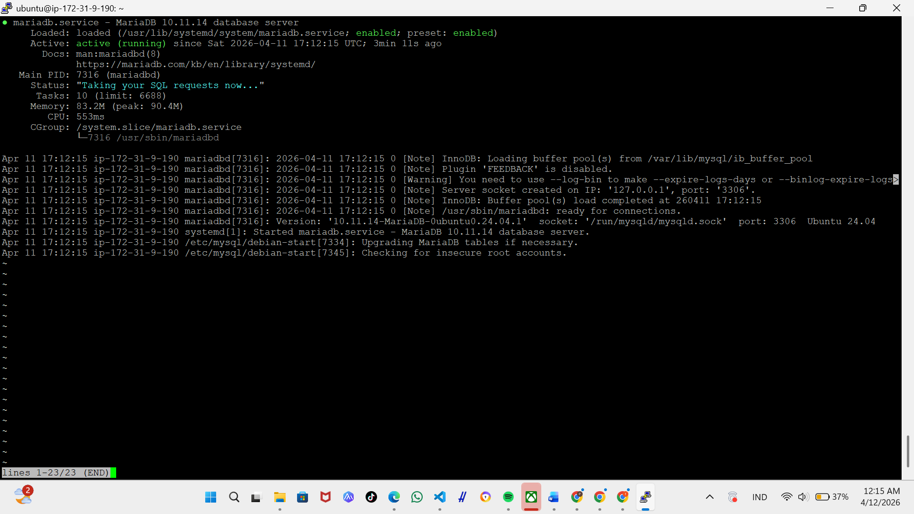
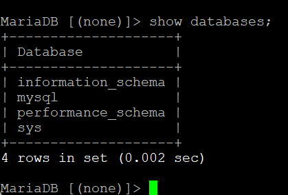
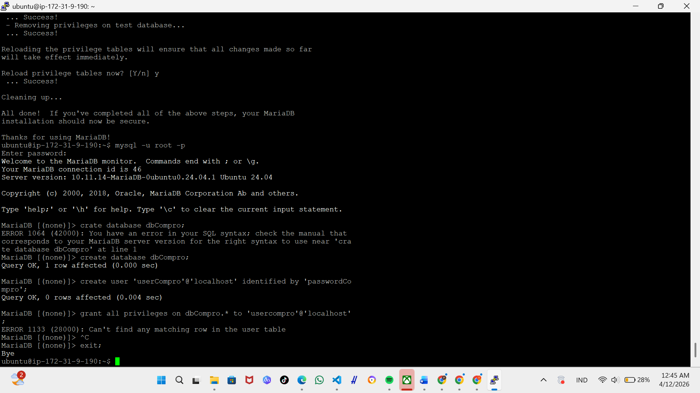
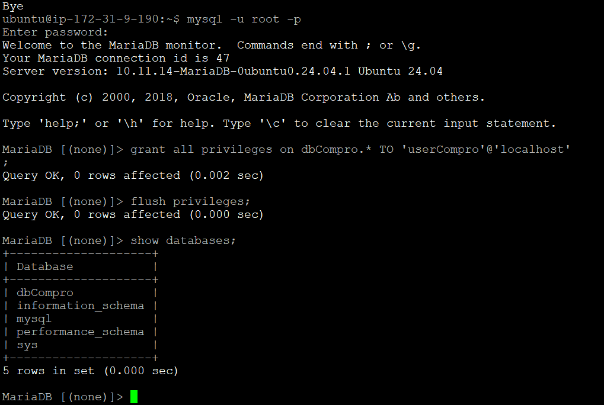

# Membuat Database mySql di aws ec2

1. aktifkan instance

2. remote SSH via terminal 
    - Masuk ke FOLDER penyimpanan Privet key
    - Masukan comment (ssh - i nama file.pem ubuntu@[ip_addres])
    - enter

3. lakuka patching os
    - sudo apt-get update && sudo apt-get upgrade

4. kita lakukan mariaDB
    - sudo apt-get install mariadb-server
    - sudo systemctl start mariadb
    - sudo systemctl enable mariadb
    - sudo systemctl status mariadb
    - coba apakah default setting yg berlaku ( sudo mysql -u root -p )
    - cek apakah masih ada data dummy (show databases;)

5. Kita Lakukan Hardening Security
 - Masukan Command (sudo mysql_secure_installation)
 - masukan password kuat untuk user root
 - Remove anonymous users (Y)
 - Disallow root login remotely (Y)
 - Remove test database and access to it (Y)
 - Reload privilege tables now (Y)

6. Membuat database dan User 
 - Membuat database untuk Web Company Profile (create database dbCompro;)
 - Membuat User untuk Web Company Profile (create user 'userCompro'@'localhost' identified by '********';)
 - Memberikan Hak Akses User untuk Web Company Profile (grant all privileges on dbCompro.* to 'userCompro'@'localhost';)
 - Flush Privilege (flush privileges;)
 - Keluar dari MySQL (exit;)

7. Login sebagai user baru
 - Masukan Command (mysql -u userCompro -p)
 - Masukan Password
 - Cek apakah database dbCompro sudah ada (show databases;)

 