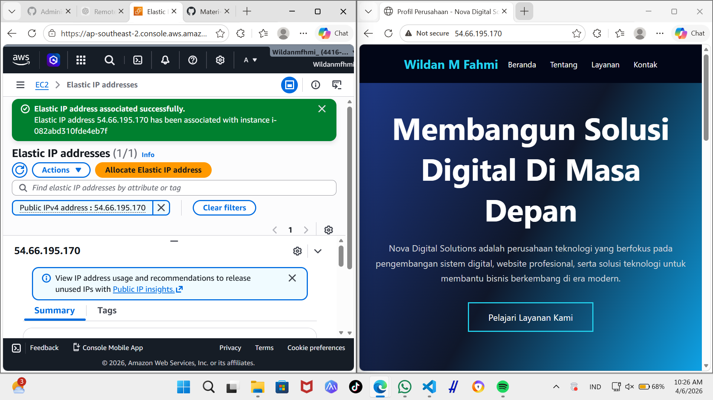

# membuat Elastic IP di AWS

1. jalanakan instance 
2. ke menu networks and scurtity kik Elastic IPs
    - klik menu allo
    - pilih Amazon's pool of IPv4 addresses
    - Network border group 

3. asosiate kan elastic ip segera mungkin (>1 jam akan kena cost)
    - centang mana EIP yang dipilih
    - pilih 

