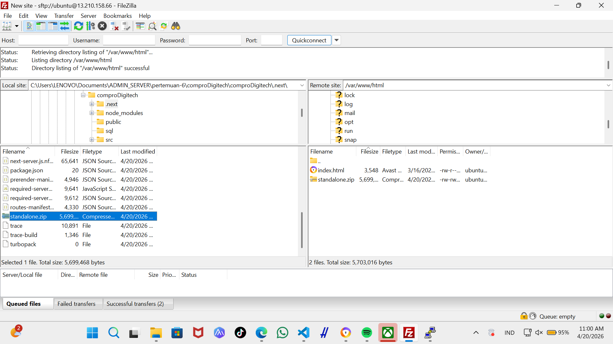
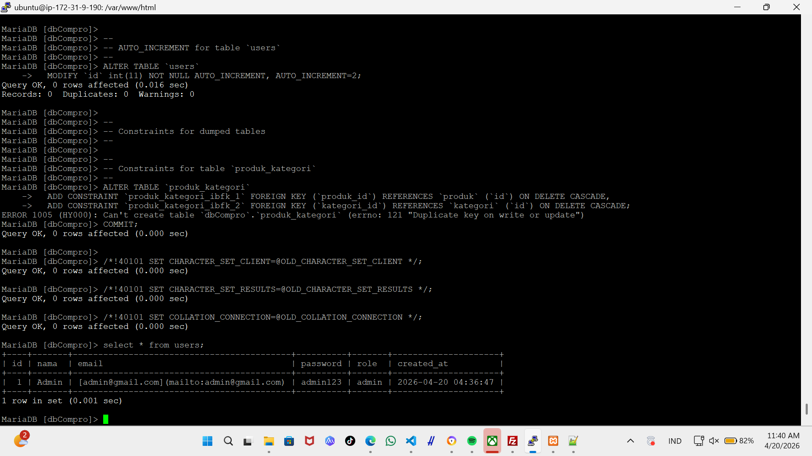
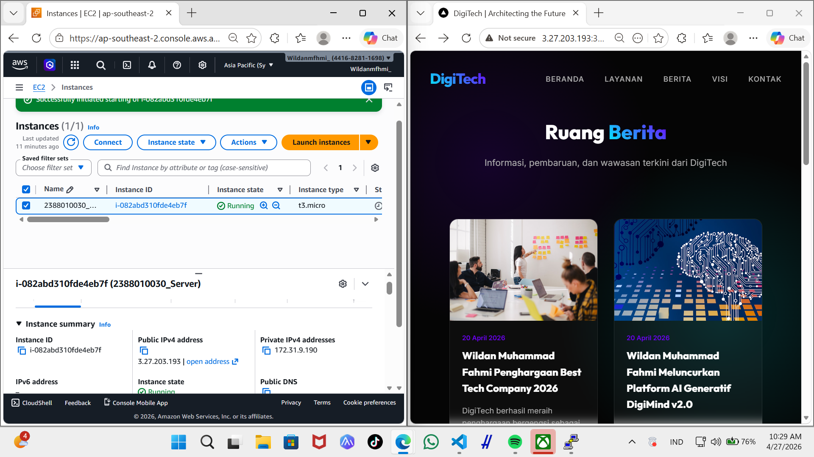
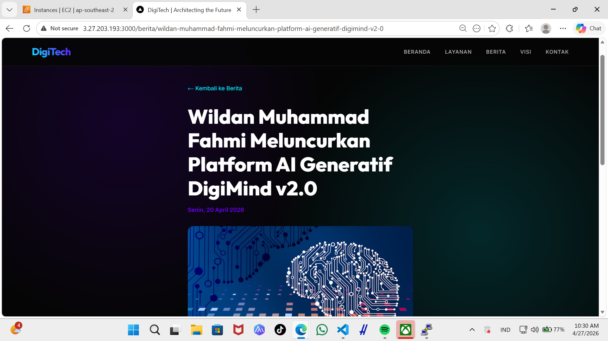

# melakukan uploding Web apps dynamic ke Ec2 AWS

1. pastikan web apps dynamic sudah berjlan tanpa error di localhost
2. jika sudah tanpa error kita akan membuat folder build
    - npm run build
    - pastika menghasilkan folder .next/stanalone didalam tersedia folder public dan di folder .next ada folder static

3. proses uploud dile folder standalone
- lakukan proses archive pada folder .next folder .next/standalone dan folder public .zip
- running instance
- uploud file hasil achive ke EC2 AWS menggunakan filezilla

- extract file hasil archive di EC2 AWS
    1. install tools unzip di EC2 AWS
        - sudo apt install unzip -y
    2. Ekstact file hasil achive
        - unzip nama_file.zip
    3. 

